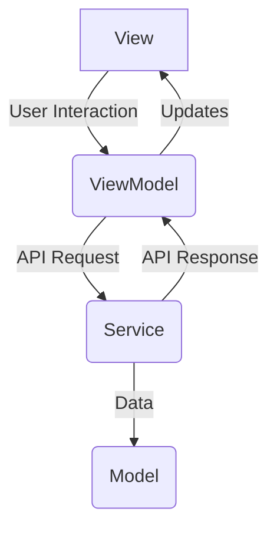

# DESIGN.md

## Overview

This document outlines the design for the "colorist" application, an interactive Flutter application that uses the Gemini API to allow users to control the app through natural language.

## Detailed Analysis of the Goal or Problem

The goal is to create a Flutter application that demonstrates the power of the Gemini API for natural language app control. Users will be able to interact with the app using text-based commands, and the app will respond by changing its state or appearance. This project is inspired by a codelab and aims to provide a clear and educational example of integrating a powerful language model into a Flutter app.

## Alternatives Considered

For a simple application like this, there are several ways to structure the code.

*   **No specific architecture (spaghetti code):** While quick for a prototype, this becomes unmaintainable as the app grows.
*   **BLoC (Business Logic Component):** A popular and powerful state management solution, but it can be verbose for a small project.
*   **Provider:** A flexible and widely used state management solution. It's a good choice, but for this project, we will stick to the more fundamental `ChangeNotifier` and `ValueNotifier` for simplicity and to minimize dependencies.

We will use the MVVM (Model-View-ViewModel) pattern with `ChangeNotifier` for state management. This provides a good balance of structure and simplicity for our use case.

## Detailed Design

### Architecture

We will use the MVVM (Model-View-ViewModel) architecture to structure the application. This separates the UI (View) from the business logic (ViewModel) and the data (Model).

*   **Model:** The data classes that represent the API requests and responses. These will be simple Dart classes, potentially using `json_serializable` for easy conversion to and from JSON.
*   **View:** The Flutter widgets that make up the UI. These will be responsible for displaying the data from the ViewModel and forwarding user input to the ViewModel.
*   **ViewModel:** The central piece of the architecture. It will contain the business logic, handle user input, and interact with the Gemini API through a dedicated service. It will use `ChangeNotifier` to notify the View of any changes.
*   **Service:** A dedicated class for handling communication with the Gemini API. This will encapsulate the `http` calls and the parsing of the responses.

### State Management

We will use `ChangeNotifier` and `ValueNotifier` for state management.

*   `ValueNotifier` will be used for simple, local state, such as the text in a `TextField`.
*   `ChangeNotifier` will be used for more complex state that is shared across multiple widgets, such as the response from the Gemini API.

### Dependencies

*   `http`: For making HTTP requests to the Gemini API.
*   `flutter_dotenv`: To securely manage the Gemini API key.
*   `json_serializable` and `json_annotation`: For JSON serialization and deserialization.
*   `go_router`: For navigation, although it will be minimal in this initial version.

## Summary of the Design

The "colorist" app will be a simple, single-screen Flutter application that demonstrates the use of the Gemini API for natural language control. It will use the MVVM architecture with `ChangeNotifier` for state management. The UI will be built using Material Design widgets.

## References

*   [Building a UI in Flutter](https://flutter.dev/docs/development/ui/layout)
*   [Adding interactivity to your Flutter app](https://docs.flutter.dev/development/ui/interactive)
*   [Using the Gemini API in a Flutter app](https://codelabs.developers.google.com/codelabs/google-gemini-api-flutter)
*   [Get started with the Gemini API](https://ai.google.dev/docs/get_started_api)
